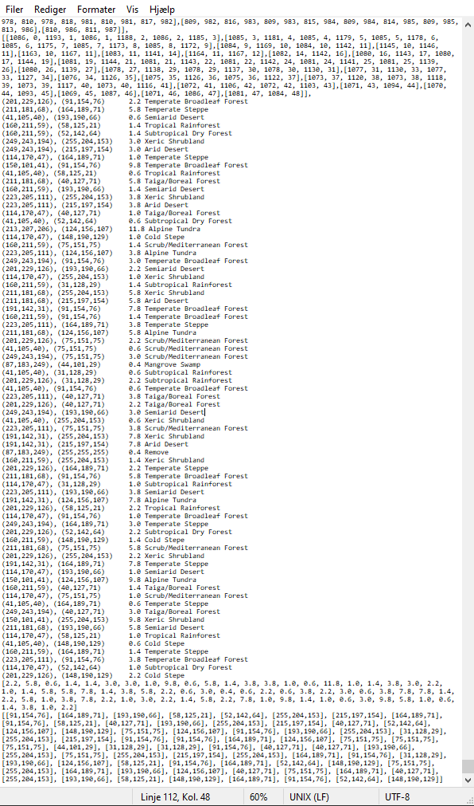
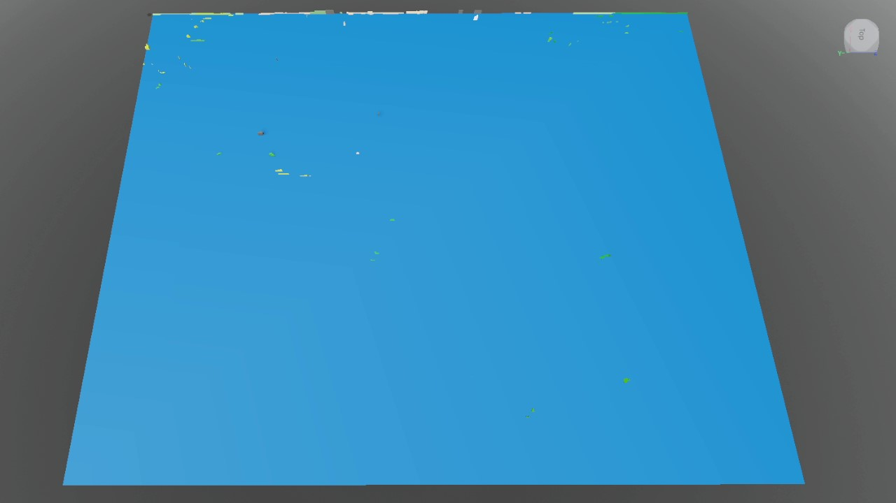
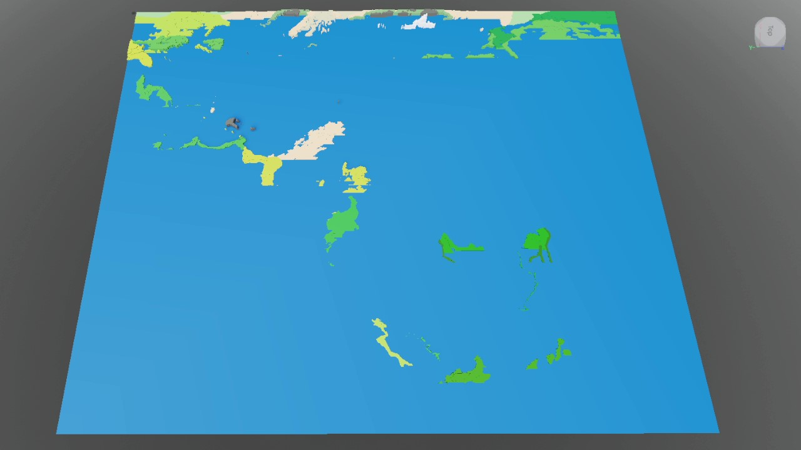
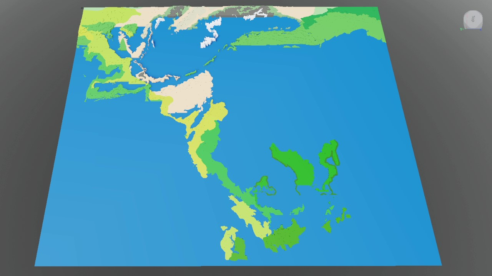
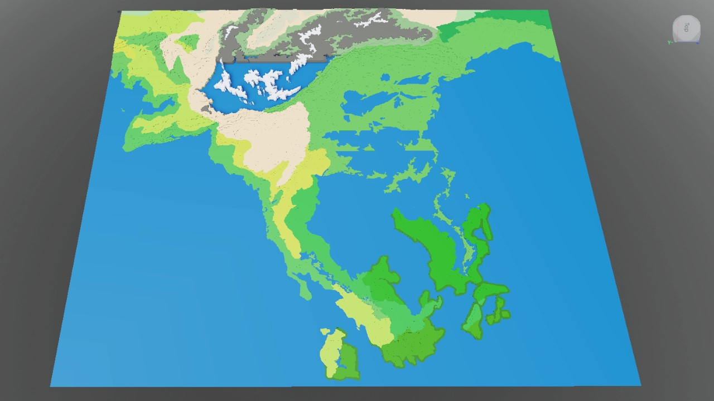
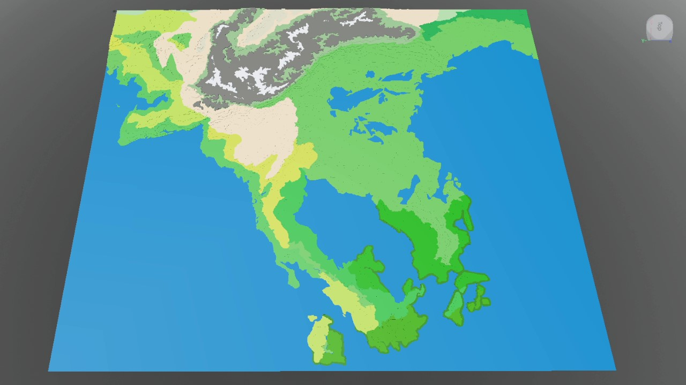

# 2022-PngToRec-and-mapmaker2
2 tools. Png2Rec transforms a png file into a list of rectangles of each color. Mapmaker2 plugin for Roblox Studio then uses the rectangles to create a 3D map in Roblox.

PngToRec uses multiple processes running in parallel, while Mapmaker2 uses multiple processes running sequentially.

----------------------------

The output of PngToRec, in the format of first coordinates. 

Then a list of biomes, heights and colors for debugging only, as unaccounted colors will show up here.

Then a list of heights in the same order as the coordinates.

Then a list of colors in the same order as the coordinates.

----------------------------

The output printing of a map in Roblox Studio with the plugin. 

